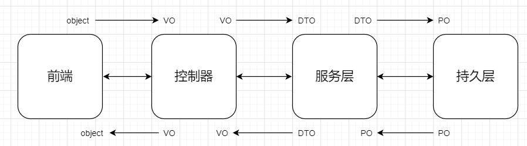

# 约定大于配置（重要）

## Flyway

在Flyway的约定上，加上本项目自己的一些约定。

### 约定1：脚本文件命名

使用简短的字符串，大致表示脚本功能，例如：`V1.0.0__DT_user.sql` `V1.0.0__DT_user#roles.sql`

下面罗列出常见的：

| 功能       | 关键字                                                       | 示例                                                | 解释                                    |
| ---------- | ------------------------------------------------------------ | --------------------------------------------------- | --------------------------------------- |
| 删除整张表 | DT: DROP TABLE tablename                                | `V1.0__DT_user.sql`, `V1.0__DT_user#role.sql`  | 删除user表，删除user和role 两张表       |
| 修改表     | AT ALTER TABLE 简写                                     | `v1.0__AT_user.sql`                                 | user表修改字段（AT是ATM，ATA，ATD超集） |
| 修改表字段 | ATM: ALTER TABLE tablename MODIFY [COLUMN] column_definition [FIRST] [AFTER col_name] | `V1.0__ATM_user.sql` `V1.0__ATM_user#role.sql` | 修改user表和role表的某些字段            |
| 增加表字段 | ATA ALTER TABLE tablename ADD [COLUMN] column_definition [FIRST \|AFTER col_umn] | `v1.0__ATA_user.sql`                                | user表新增某些字段                      |
| 删除表字段 | ATD ALTER TABLE tablename DROP [COLUMN] col_name        | `v1.0__ATD_user.sql`                                | user表删除某些字段                      |
| 插入记录   | IT INSERT INTO tablename (filed1,filed2,...,filedn) values(value1,value2,...,valuen); | `v1.0__IT_user.sql`                                 | user表插入记录                          |
| 更新记录   | UT UPDATE tablename SET filed1=value1,filed2=value2,...,filedn=valuen [WHERE CONDITION] | `v1.0__UT_user.sql`                                 | user表更新记录                          |
| 删除记录   | dt DELETE FROM tablename [WHERE CONDITION]              | `v1.0__dt_user.sql`                                 | user表删除记录                          |

## POJO

### 简介

[简介](https://blog.csdn.net/uestcyms/article/details/80244407)

本项目的约定如下

### 约定1：试图层，服务层，持久层 使用对应XO

解释：

1. 前端传递对象到视图层（控制器），视图层使用VO来接收（避免参数太多，前端根据文档，传参迷茫~）

2. 视图层将VO转换成DTO，然后将DTO传递给服务层。服务层可能需要其他额外的参数
3. 服务层，将DTO转换成PO，一个PO对应数据库一个记录，进行数据库持久化操作。
4. 持久层将PO返回给服务层，服务层将其转换成DTO继续业务处理。
5. 业务层可能还会使用BO
6. 业务层将DTO返回给视图层。
7. 控制层将服务层返回的DTO，进行转换成前端需要的数据及VO

