# goudong
该项目是使用maven进行打包构建，使用Spring Boot、Spring Cloud、Spring Cloud Alibaba搭建的微服务电商后端项目，该项目提供的接口根据Restful接口风格进行设计


## 模块

| 模块                              |      | 作用描述                                                     | 端口  |
| --------------------------------- | ---- | ------------------------------------------------------------ | ----- |
| goudong-dependencies-spring-boot  |      | 统一管理所有依赖版本                                         |       |
| goudong-parent-spring-boot        |      | 自定义spring boot 启动器的父模块                             |       |
| goudong-core                      |      | 使用JDK的库编写常用代码，仅引入了SLFJ，不依赖其它第三方工具包 |       |
| goudong-redis-spring-boot-starter |      | 封装spring-boot-starter-data-redis，使用自定义key模板,接口限流等 |       |
| goudong-web-spring-boot-starter   |      | 封装spring-boot-starter-web，全局异常，定义分页，分页结果转换器 |       |
| goudong-commons                   |      | 微服务模块统一的代码                                         |       |
| goudong-gateway-server            |      | 网关服务，微服务入口，加解密，鉴权等                         | 10000 |
| goudong-user-server               |      | 用户服务，用户相关的操作                                     | 10001 |
| goudong-oauth2-server             |      | 权限服务，权限，白名单等                                     | 10002 |
| goudong-message-server            |      | 消息服务，发送短信，邮件                                     | 10003 |
| goudong-file-server               |      | 文件服务，文件的上传，下载，导入导出等                       | 10004 |
| goudong-bpm-server                |      | 流程服务                                                     | 10005 |
| goudong-commodity-server          |      | 商品服务                                                     |       |
| goudong-modules                   |      | 模块，学习一些常用组件的代码笔记                             |       |


## 软件及配置项
### 依赖的软件/组件及其版本
| 软件/组件       | 版本             |
| ----- |----------------|
| spring-cloud | Hoxton.SR12    |
| spring-cloud-alibaba | 2.2.7.RELEASE  |
| spring-boot | 2.3.8.RELEASE  |
| MySQL | 8.0.16         |
| Redis | 3.0.504(后期会升高) |
| MongoDB | 4.4            |
| Erlang | 23             |
| RabbitMQ | 3.8.9          |
| Nacos | 2.0.3          |
| Sentinel | 1.8.1          |
| Seata | 1.3.0          |
| sentinel-dashboard | 1.8.2          |

> 记录版本，防止使用其它版本有冲突。

### 操作系统环境变量配置
需要修改自己对应的属性值。
#### Windows
```bash
@echo off
echo windows平台设置goudong环境变量
:: MySQL
SET MYSQL_USERNAME=MySQL用户名
SET MYSQL_PASSWORD=MySQL密码

:: Redis
SET REDIS_PASSWORD=Redis密码

:: RabbitMQ
SET RABBITMQ_USERNAME=RabbitMQ用户名
SET RABBITMQ_PASSWORD=RabbitMQ密码

:: 邮箱
SET EMAIL_USERNAME=邮箱账户
SET EMAIL_PASSWORD=邮箱密码

:: 阿里云短信
SET ALI_MESSAGE_ACCESS_KEY_ID=短信key
SET ALI_MESSAGE_ACCESS_KEY_SECRET=短信密码
SET ALI_MESSAGE_SIGN_NAME=短信签名
SET ALI_MESSAGE_TEMPLATE_CODE=短信模板

echo 正在设置中,请稍等...
setx "MYSQL_USERNAME" "%MYSQL_USERNAME%"
setx "MYSQL_PASSWORD" "%MYSQL_PASSWORD%"
setx "REDIS_PASSWORD" "%REDIS_PASSWORD%"
setx "RABBITMQ_USERNAME" "%RABBITMQ_USERNAME%"
setx "RABBITMQ_PASSWORD" "%RABBITMQ_PASSWORD%"
setx "EMAIL_USERNAME" "%EMAIL_USERNAME%"
setx "EMAIL_PASSWORD" "%EMAIL_PASSWORD%"
setx "ALIBABA_MESSAGE_ACCESS_KEY_ID" "%ALI_MESSAGE_ACCESS_KEY_ID%"
setx "ALIBABA_MESSAGE_ACCESS_KEY_SECRET" "%ALI_MESSAGE_ACCESS_KEY_SECRET%"
setx "ALIBABA_MESSAGE_SIGN_NAME" "%ALI_MESSAGE_SIGN_NAME%"
setx "ALIBABA_MESSAGE_TEMPLATE_CODE" "%ALI_MESSAGE_TEMPLATE_CODE%"

pause
```
> 注意：
> 如果有信息是以下字符的，需要转义（使用^符号，如&应该写成^&）
> + @命令行回显屏蔽符
> + %批处理变量引导符
> + \>重定向符
> + \>> 重定向符
> + \<、>、<& 重定向符
> + | 命令管道符
> + ^ 转义字符
> + & 组合命令
> + && 组合命令
> + || 组合命令
> + ""字符串界定符
> + , 逗号
> + ; 分号
> + () 括号
> + ! 感叹号
> 
#### Linux
在 /etc/profile.d下创建一个新的goudong-java-variable.sh 文件，然后将下面的内容复制进去，保存退出。最后执行 source /etc/profile.d/goudong-java-variable.sh 即可
```shell
# set goudong-java environment variable
echo centos平台设置goudong环境变量
# mysql
export MYSQL_USERNAME=MySQL用户名
export MYSQL_PASSWORD=MySQL密码

#Redis
export REDIS_PASSWORD=redis密码

# RabbitMQ
export RABBITMQ_USERNAME=rabbitmq用户名
export RABBITMQ_PASSWORD=rabbitmq密码

# 邮箱
export EMAIL_USERNAME=邮箱
export EMAIL_PASSWORD=右相对应的密码

# 阿里云短信
export ALI_MESSAGE_ACCESS_KEY_ID=阿里云短信访问key id
export ALI_MESSAGE_ACCESS_KEY_SECRET=阿里云短信访问key 密钥
export ALI_MESSAGE_SIGN_NAME=短信签名
export ALI_MESSAGE_TEMPLATE_CODE=短信签名模板code

echo "设置goudong环境变量完成"
```
> 有特殊字符的时候使用单引号将所有值包起来


## 安全
### RSA
使用非对称加密算法RSA,在前端使用RSA公钥进行加密数据，后端通过RSA私钥进行解密。
例如：
1. 对安全较高的支付信息，密码等。
2. 大多场景：前端请求接口时，随机生成一个AES密钥明文，使用AES算法将请求参数加密，
并使用RSA公钥将AES密钥明文加密成密文后放在请求头中， 最后一切准备好了发起Http请求，
后端使用RSA私钥解密AES密钥密文，获得AES密钥明文，然后再根据AES密钥明文进行解密参数。
### AES
对称加密算法，速度较RSA更快。
实际应用：
1. 前端生成随机AES密钥，使用AES密钥加密请求体传输数据（使用RSA将AES密钥加密添加请求头）。
2. 后端网关根据随机AES密钥进行解密/加密。
3. 前端使用AES密钥，将后端的加密的数据进行解密。

## 流程图
每个模块都根据自身业务，将一些有趣的业务进行流程图绘制，这些流程图一般都保存在项目根目录的**README.assets**目录下 。


## 获取当前登录用户
前提条件：
1. 启动网关服务(goudong-gateway-server)
2. 启动认证服务(goudong-oauth2-server)
3. 服务启动类加上注解`@ServletComponentScan(basePackageClasses = {UserContextFilter.class})`。

获取当前用户：
```java
// 获取发起请求的用户信息，获取不到返回一个匿名用户
UserContext.get()
```
## 认证
使用认证服务进统一认证。

##鉴权
本项目，在网关层进行调用认证服务进行接口鉴权。

## 约定大于配置（重要）
### 数据库表设计
每张表应该都有6个属性：id、create_time、create_user_id、update_time、update_user_id、deleted（DEFAULT NULL）

```sql
CREATE TABLE `table_name` (
  `id` bigint(20) unsigned NOT NULL COMMENT '主键id',
  `deleted` bit(1) DEFAULT b'0' COMMENT '是否被删除,逻辑删除和唯一索引因素，这里允许为空',
  `update_time` datetime(6) NOT NULL ON UPDATE CURRENT_TIMESTAMP(6) COMMENT '更新时间',
  `create_time` datetime(6) NOT NULL COMMENT '创建时间',
  `update_user_id` bigint(20) unsigned NOT NULL DEFAULT '0' COMMENT '更新人id',
  `create_user_id` bigint(20) unsigned NOT NULL DEFAULT '0' COMMENT '创建人id',
  PRIMARY KEY (`id`) USING BTREE
) ENGINE=InnoDB DEFAULT CHARSET=utf8mb4 COLLATE=utf8mb4_0900_ai_ci ROW_FORMAT=DYNAMIC COMMENT='xxx';
```

### 实体类
强制：必须包含无参构造函数（jackson序列化时有需要无参）


### Flyway

在Flyway的约定上，加上本项目自己的一些约定。

### 实体类型

#### 简介

[简介](https://blog.csdn.net/uestcyms/article/details/80244407)

本项目的约定如下

#### 约定1：各层的对象类型定义
前端给控制器传递的DTO和控制器给服务层传递的DTO需要根据情况使用两个不同的DTO（方便扩展）


解释：

1. 前端传递对象到控制器层（控制器），控制器层使用DTO来接收（避免参数太多，前端根据文档，传参迷茫~）
2. 控制器层将DTO转换成服务层需要的DTO对象，然后将DTO传递给服务层（提高服务层的可用性）。
3. 服务层，将DTO转换成PO，一个PO对应数据库一个记录，进行数据库持久化操作。
4. 持久层将PO返回给服务层，服务层将其转换成DTO继续业务处理。
5. 业务层可能还会使用BO（复杂大对象）
6. 业务层将DTO返回给控制器层。
7. 控制器层将服务层返回的DTO，进行转换成前端需要的数据DTO


### HTTP 响应代码

项目基本参照 [规范](https://developer.mozilla.org/zh-CN/docs/Web/HTTP/Status) 来正确返回响应码

## 日志

使用log4j2：

1. 配置了开发环境和生产环境日志配置文件。
2. 配置日志归档及日志删除策略。

### log4j2.xml中格式转换字符

使用是需要加上`%`，例如`%c`。

| 字符 | 描述                                                         | 备注                                                    |
| ---- | ------------------------------------------------------------ | ------------------------------------------------------- |
| c    | category的名称，可使用｛n}限制输出的精度。例如：logger名为"a.b.c"，%c{2}将输出"b.c"。（获取Logger对象类的完全限定名） | 输出Logger对象的名字，完全类名                          |
| C    | 产生log事件的java完全限定类名。可使用｛n}限制输出的精度。例如：“org.apache.xyz.SomeClass”,%C{2}将输出“SomeClass”。 | 硬编码日志打印的完全类名                                |
| d    | 时间和日期的输出格式，例如：%d{yyyy MM dd HH:mm:ss,SS}，可不带后面的日期格式字符。 | 输出日期                                                |
| F    | 产生log事件的java源文件名，带“.java”后缀及包名称。           | 输出的是文件名，是字符c的输出的简写                     |
| l    | log发生位置的详细描述，包括方法名、文件名及行号。            | 发生位置：打印日志的地方                                |
| L    | log发生在源文件中的位置。                                    | 发生位置的行号                                          |
| m    | log事件的消息内容。                                          | 输出的日志内容                                          |
| M    | log发生时所在的方法名称。                                    | 无                                                      |
| n    | 根据所运行的平台输出相应的行分隔字符。                       | 默认 `-`                                                |
| p    | log事件的级别。                                              | OFF > FATAL > ERROR > WARN > INFO > DEBUG > TRACE > ALL |
| r    | 自程序运行至log事件产生所经过的时间。                        | 单位是ms                                                |
| t    | 产生log的线程名称。                                          | 无                                                      |

### 颜色

`%style{%d}{bright,green}`, 只需要将`%d`和`green` 修改成上面介绍的字符和颜色单词即可。


> 通过在``application.yml`中的`spring.profiles.active: xxx` 配置，然后在application-xxx.yml文件中配置`logging.config.classpath: log4j2-dev.xml` 属性，让其在不同环境不同日志配置。


## 模块功能描述

### goudong-user-server

用户服务，包含的功能：用户，角色，权限，白名单的增删改查。


## 出色功能

### 接口防重复调用

这里使用aop进行简单的限制

1. 注入Bean RepeatAop
2. 给需要的接口添加@Repeat注解，默认是2秒内，也可以自定义配置属性time和timeUnit


### 白名单

1. 在配置文件中开启白名单，配置`commons.whitelist.enable=true`即可。
2. 在Restful接口上使用注解@Whitelist，标明这个Restful接口是一个白名单。
```java
@GetMapping("/check-registry/phone/{phone}")
@ApiOperation(value = "检查手机号", notes = "检查手机号是否可以使用，true可以使用")
@ApiImplicitParam(name = "phone", value = "手机号")
@Whitelist("根据手机号获取账号")
public Result<Boolean> getUserByPhone(@PathVariable String phone) {//.......}
```
```yml
# commons配置
commons:
  # 白名单配置
  whitelist:
    # 是否开启白名单（生产环境建议不开启）
    enable: false
    # 自定义其他框架静态资源。
    whitelists:
      - pattern: /api/*.html
        method: GET
      - pattern: /api/*.js
        method: GET
      - pattern: /api/whitelist/**
        method: GET,POST,DELETE,PUT
```


具体流程如下：



### 接口请求日志

1. 注入Bean LoggingAop
2. 开发环境，在配置文件配置属性:`logging.level.包名: DEBUG`，开启

使用AOP进行接口请求日志打印，将请求路径，请求参数，响应数据，异常等信息打印日志

### RedisTemplate扩展

RedisTool，主要是因为整个系统的redis key 进行统一枚举处理（RedisKeyEnum），需要将key模板解析，redis失效等额外信息进行处理封装。


## 其它

### banner 使用
在[banner在线设计网页](http://patorjk.com/software/taag/#p=display&f=Graffiti&t=Type%20Something%20) 中设计banner。
> 其它颜色的用法参考：[用了自定义Banner后，SpringBoot瞬间变的高大上了...](https://blog.csdn.net/weixin_44742132/article/details/105721684) 
> Font 选择 Big

