# goudong-file-online-preview-server
待办列表
1. 文件在线预览（主要是前端）
2. 定时任务-删除之前的临时文件和分片任务
## 基础配置
### 上传配置
上传文件的一些配置，可以配置是否允许上传，且可以自定义上传文件路径（默认是在用户目录下的'/goudong-file-server'），还可以自已配置指定文件类型
上传文件大小。
> 具体配置可以查看com.goudong.file.properties.FileProperties文件属性类。
> 当`file.upload.enable=false`时，用户在上传文件时会出现错误。
```yaml
file:
  upload:
    enable: true
    enable-full-path-model: true
    root-dir: 'd:/goudong-file-server'
```

## 上传
1. 普通上传
2. 分片上传
### 普通上传
一次性上传文件
缺点：一次性上传，当用户上传一半时网速不好会导致上传失败。这个时候只能重新上传，既浪费服务器带宽，又耽搁用户时间，用户体验不好。
优点：实现简单，前后端工作小。上传小文件时比分片性能要高些，避免了多次请求。
### 分片上传
缺点：前后端都需要额外处理，工作量上来了。分片上传比普通上传要多”几次“请求
优点：前端将文件分片上传，后端保存任务，即使上传中断了，在一定时间里，还能继续上传。

**流程**

分片上传预检流程图：


分片上传流程


