# 微服务网关
网关是整个微服务API请求的入口，负责拦截所有请求，分发到服务上去。可以实现日志拦截、权限控制、解决跨域问题、限流、熔断、负载均衡，隐藏服务端的ip，黑名单与白名单拦截、授权等。
Spring Cloud Gateway是一个全新的项目,其基于spring5.0 以及springboot2.0和项目Reactor等技术开发的网关,其主要的目的是为微服务架构提供一种简单有效的API路由管理方式.

## 功能描述
1. 统一鉴权
2. 将请求体解密，响应体加密

### 统一鉴权
在网关中实现了对所有服务访问的鉴权。
### 将请求体解密，响应体加密
具体流程图如下：

流程讲解：
1. （详情看前端的README）客户端发起一个**POST**的请求，请求头`content-type`值是**application/json**并且还携带一个自定义的请求头`Aes-Key`，值是一个AES随机密钥被后端RSA公钥加密过后的密文）。
2. 进入Gateway的`PostRequestParameterDecrypt`，判断请求是否满足解密的条件：是否是post请求?是否是application/json的媒体类型?是否存在AES密钥?
    1. 当满足所有条件时，需要额外处理请求和响应。
    2. 反之，不对请求体和响应体进行任何额外的处理。
3. 当请求满足上一步列举的所有条件后，需要
