# 微服务网关
网关是整个微服务API请求的入口，负责拦截所有请求，分发到服务上去。可以实现日志拦截、权限控制、解决跨域问题、限流、熔断、负载均衡，隐藏服务端的ip，黑名单与白名单拦截、授权等。
Spring Cloud Gateway是一个全新的项目,其基于spring5.0 以及springboot2.0和项目Reactor等技术开发的网关,其主要的目的是为微服务架构提供一种简单有效的API路由管理方式.

## 功能描述
1. 统一鉴权
2. 将请求体解密，响应体加密

### 统一鉴权
在网关中实现了对所有服务访问的鉴权,并将用户信息绑定到请求头中供其它服务获取请求用户信息。
> 子服务获取登录用户：
> 1. 启动类加上:`@ServletComponentScan(basePackageClasses = {UserContextFilter.class})`
> 2. 获取登录用户信息：`UserContextFilter.get()`;

**大致流程如下：**



**详细流程如下：**




### 将请求体解密，响应体加密
具体流程图如下：



流程讲解：
1. 客户端发起请求，请求方式是**POST**，请求头中的`Content-Type`值是**application/json**,
请求体是一个字符串（随机生成的一个AES密钥，使用密钥进行AES加密后的json字符串），
并且还携带一个自定义的请求头:`X-Aes-Key`， 其值是随机AES密钥使用RSA公钥加密过后的字符串。（详情看前端的README）

   例如：
   ```shell
      $ curl -X POST \
        -H "Content-Type:application/json" \
        -H "X-Aes-Key:XXXX"  --data "参数密文" http://127.0.0.1:10000/api/user/demo/secrypt
   ```
2. 请求开始进入Gateway，根据路由进入到创建的过滤器，当请求扭转到`ReqResBodyCryptoFilter`过滤器，该过滤器判断请求是否满足解密的条件： 
   ```txt
   条件一：是否是post请求?
   条件二：请求参数的媒体类型是否是application/json的媒体类型?
   条件三：是否存在AES密钥?
   ```
    1. 当请求同时满足上述所有条件时，需要进行请求体解密，响应体加密。
    2. 反之，不对请求体和响应体进行任何额外的处理。
3. `ReqResBodyCryptoFilter`首先会将请求头`X-Aes-Key`的值进行RSA私钥解密。
然后读取本次请求的body，然后使用AES密钥进行解密。然后创建一个新的请求，其它都不变只是将请求体改为解密后的内容以及
请求头修改。这样其它服务都正常处理逻辑即可，不需要考虑解密的问题。
4. 当网关开始处理响应时，如果本次情趣是走了上一步骤的话，那么就自动的将其响应体进行加密，加密的方式还是采用AES算法加密，
其密钥就是上一步骤解密的密钥。
5. 客户端收到Gateway网关响应后，根据之前AES的密钥进行解密。
