# GOUDONG-OAUTH2-SERVER
待办列表：
1. 接入Oauth2.0
2. 菜单（页面菜单/按钮菜单）进行分配权限

认证授权服务
## 认证流程
本服务作为整个微服务的认证入口，支持用户名密码登录,接入qq快捷登录，微信登录(微信未接入需要企业)

根据用户选择登录方式进行处理登录流程。
### 认证成功处理流程
本项目支持配置认证信息(详情请查看`com.goudong.oauth2.properties.TokenExpiresProperties`源码)，例如：
```yaml
# 配置oauth2
oauth2:
  # 配置令牌失效时长
  token-expires:
    # 是否允许同时登陆
    enableRepeatLogin: false
    # 浏览器
    browser:
      access: 1
      access-time-unit: hours
      refresh: 2
      refresh-time-unit: hours
    # app
    app:
      access: 7
      access-time-unit: days
      refresh: 15
      refresh-time-unit: days
```
1. 配置同一个账号是否允许同时登陆
2. 配置browser/app 访问令牌有效时长，刷新令牌有效时长

大致流程如下：


2. http://localhost:10003/api/oauth2/oauth/authorize?response_type=code&client_id=admin&redirect_uri=http://www.baidu.com&scope=all&state=normal
3. 
# Oauth2.0
讲解和教程：https://mp.weixin.qq.com/s/IjNtY9gYpfP6-hOuatlMfQ


## HTTP请求头/响应头

### 请求头
接口请求时（除去登录接口），需要带上Authorization请求头
[Authorization]<https://cloud.tencent.com/developer/section/1189908>
### 响应头
当认证过期时，需要带上WWW-Authenticate响应头
WWW-Authenticate: <type> realm=<realm>
[教程]<https://cloud.tencent.com/developer/section/1190024>

